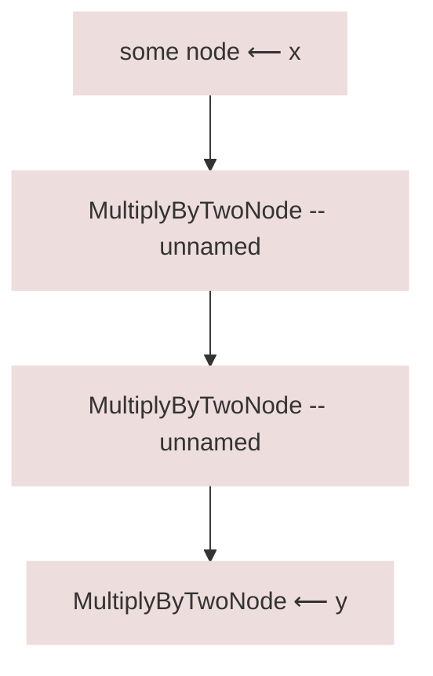
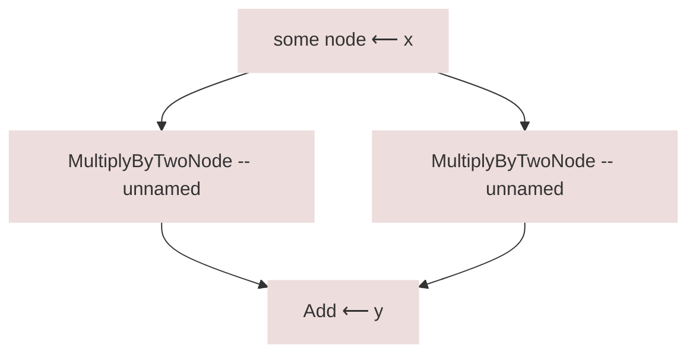
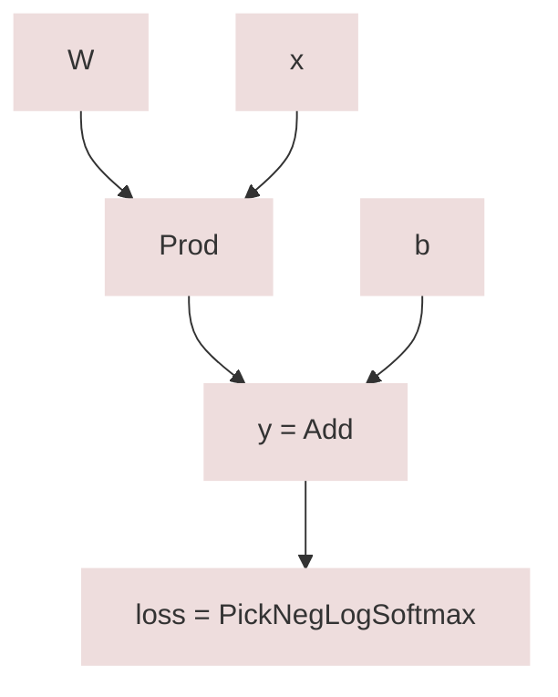
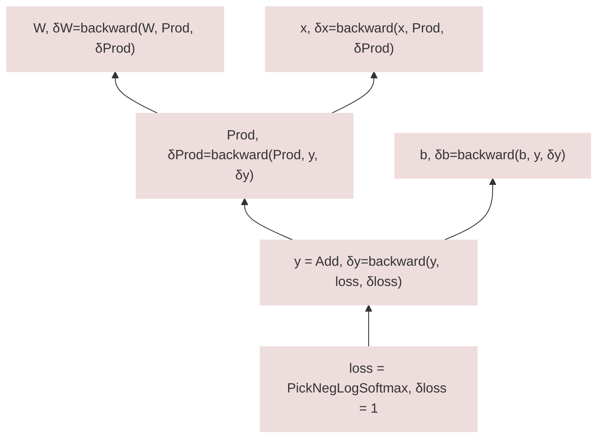

## Nodes

<span style="position: absolute; top: 20px; right: 20px;"> Defined in <code><a href="https://github.com/ginn-org/ginn/blob/main/ginn/node.h"> \<ginn/node.h\> </a></code> </span>

A computation graph (specifically a DAG) consists of computation nodes and
connections between them. Each node can implement a unit of computation
(a function) or simply be a constant data (e.g. a vector). Such a node
is implemented by the `BaseNode` abstract class:

```cpp
template<typename T>
using Ptr = std::shared_ptr<T>; // ⚠️ NOT true but very close,
                                //   simplified for docs purposes

class BaseNode {
 private:
  bool forwarded_ = false;
  std::vector<Ptr<BaseNode>> ins_;
  
  virtual void forward_() = 0;
  virtual void backward_() {}
  
 public:
  virtual bool has_grad();
  void forward() { forward_(); forwarded_ = true; };
  void backward() { if (has_grad()) { backward_(); } }
};

template <typename Scalar>
class Node : public BaseNode {
 public:
  Tensor<Scalar>& value() = 0;
  Tensor<Scalar>& grad() = 0;
};

template <typename Scalar>
using NodePtr = Ptr<Node<Scalar>>;
```

A node is either some function $y=f(x_1, ..., x_d)$ of its inputs,
or a constant $y$ (it might be easier to think of a constant as constant
function of anything). Then

- `value()` defines the value $y$, output by the function implemented by this
node (could be a constant).
- `grad()` defines $\delta y = \partial L / \partial y$, where $L$ is some loss
that is defined later in the graph. `grad()` facilitates automatic
differentiation by providing intermediate values in the chain rule.
- `ins_` contains pointers to the input nodes. Trivially, `ins_` is an empty
`std::vector` if this is a constant (leaf) node, since there are no inputs.

Note that for any given parameter $W$,
$\delta W = \partial L / \partial W$ can be computed as
$\sum_x \partial L / \partial x \cdot \partial x / \partial W$,
which motivates the use of `grad()` as defined above.

?> `BaseNode` is _not_ template on the scalar type because an arbitrary mixed
precision computation graph can have heterogeneous scalar types and we need to
be able to put all of them in the same container. Derived `Node` class hovewer
is template on the `Scalar` type because it contains template `value` and `grad`
tensors that depend on `Scalar`.

- `forward()` computes $y$ given $x_1,...,x_d$, which is equivalent to $f$, and
assigns it to `value()`.
- `backward()` computes the appropriate gradients $\delta x$, given
$\delta y$ (`grad()`), $x_1,...,x_d$ (`ins_[i]->value()`) and $y$
(`value()`), and assigns it to input gradients `ins_[i]->grad()`.

Crucial part of automatic differentiation is the job of `backward()`. Observe
that $\partial L / \partial x = \sum_y \partial L / \partial y \cdot \partial y / \partial x = \delta y \cdot \partial y / \partial x$.
Assuming `grad()` (which is $\delta y$) appropriately populated by the nodes
downstream, the remaning work is $\partial y / \partial x$ which is simply
the derivative of my function, $f'$. `backward()` computes this derivative
and multiplies by `grad()` as needed.

As an example, a `MultiplyByTwoNode` node would look like this:

```cpp
class MultiplyByTwoNode : public Node<Real> {
 private:
  Tensor<Real> y, dy;
  NodePtr<Real> x;
  
  void forward_() { value() = x->value().t() * 2.; }
  void backward_() { 
    if (x->has_grad()) { x->grad() += grad().t() * 2.; }
  }

 public:
  Tensor<Real> value() { return y; }
  Tensor<Real> grad() { return dy; }
  
  MultiplyByTwoNode(NodePtr<Real> in) : Node<Real>({in}), x(in) {}
};
```

In this case $y = f(x) = 2x$ and $\delta x = \delta y \cdot \partial y / \partial x = \delta y \cdot 2$ which is implemented by
`grad().t() * 2.`.

_Nodes as building blocks that contain pairs of `value()` and `grad()`
make up the single most important component that enable efficient
backpropagation._ Any complicated function that is implemented as a
composition of these nodes become automatically differentiable.

## Factories of nodes

Observe that inputs `ins_` to each node is stored as a shared pointer. We want
each node to stay alive as long as there are other nodes depending on its value,
thus, shared ownership is natural. A node can feed into multiple nodes, or user
might have a handle to inspect its `value()` or `grad()` later. As long as these
handles or reverse dependent nodes exist, this node should stay alive.

However this means that `Node`s are intended to be used as `shared_ptr`s and not
as plain objects. Calling `std::make_shared<MultiplyByTwoNode>(input)` every
time we want to create a node of that type can be cumbersome, especially when
we want to chain nodes (expressions).

To simplify syntax, each node type has an associated factory function that
forwards constructor arguments, something like:
```cpp
auto MultiplyByTwo(...) {
  return std::make_shared<MultiplyByTwoNode>(...);
  // ⚠️ again, simplified for docs and NOT exactly true
  //   but close, since Ptr != shared_ptr
}
```
This simplifies syntax considerably, especially when chaining such operations:
```cpp
auto y = MultiplyByTwo(MultiplyByTwo(MultiplyByTwo(x)));
```

To conclude, each node `SomeNode` has an accompanying factory function
`Some()` that returns a `std::shared_ptr<SomeNode>` (or `Ptr<SomeNode>` in truth).
Ginn is designed such that each node is created and manipulated using these
factory functions rather than using the raw objects directly.
If you are using node constructors directly, you are likely to be doing something
wrong or encountered a very niche use case.

## Building expression graphs

Compound expressions are built using simpler `Node`s. Reiterating the example
above
```cpp
auto y = MultiplyByTwo(MultiplyByTwo(MultiplyByTwo(x)));
```

would construct a computation graph like:



Of course, a graph does not need to be a chain and can be an arbitrary DAG:
```cpp
auto y = Add(MultipyByTwo(x), MultiplyByTwo(x));
```

Because of the fact that inputs are stored as shared pointers, `y` being alive
keeps the two unnamed `MultiplyByTwoNode`s alive.

If we want to compute the result of the computation, we need to call
`y->forward()`. However, `forward()` for a node assumes that inputs to that node
are already `forward()`ed. This means that we need to `forward()` the two
`MultiplyByTwoNode`s first, and before we do that, we need to `forward()` `x`
first.

Ginn has a `Graph` object that traverses the sink node backwards and builds a
list (`std::vector`) of each node in topological order.
```cpp
Graph g(y);
// at this point, g.nodes() looks like: {
//   x,
//   unnamed MultiplyByTwoNode,
//   unnamed MultiplyByTwoNode,
//   y
// }
```
Calling `forward()` on the graph simply runs a for-loop calling `forward()` on
each node in `g.nodes()`.
```cpp
g.forward(); // same as for(auto& n : g.nodes()) { n->forward(); }
// y->value() is now populated
std::cout << y->value() << std::endl;
```

## Computing gradients

Automatic backward differentiation / backpropagation works by computing the
derivative of a _single thing_ (a scalar) w.r.t. _many things_ (maybe all
parameters). As we
have seen before, we have defined `grad()` as the variables in which the 
derivatives is taken w.r.t. But what are we taking the derivative of?

In almost all cases that we are interested in, we want to minimize a loss
function which is implemented as a single scalar sink node in the computation
graph, say, $L$. 

Let's say we work in a (multiclass) logistic regression setting:
```cpp
size_t y_true = ... /* true label for x */
auto y = W * x + b;
loss = PickNegLogSoftmax(y, y_true); // neg-log likelihood over softmaxed vals

Graph g(loss);
g.forward();
```

The graph looks like:


In this case $L=$`loss`$=$`PickNegLogSoftmax`. We are interested in
$\partial$`loss`$ / \partial $`W` and $\partial$`loss`$ / \partial $`b`.

It is apparent that the `backward()` routine should start from the node `loss`.
However it is defined recursively in terms of downstream gradients. How does
`backward()` work for a sink node when it doesn't have a downstream gradient
from a reverse dependent node?

One answer is: since `loss` doesn't have any reverse dependencies, its error
signal must be _external_, i.e. user must incur an explicit gradient signal to
initiate `backward()`:
```cpp
g.reset_grad();
loss->grad().fill(1.); // explicit grad prop by hand
g.backward();
```
This way, `PickNegLogSoftmaxNode` will compute the gradients to its inputs
`y`, given that its own `grad()` is 1, and then `y = Add({W*x, b})` will
compute the gradients w.r.t. `W*x` and `b`, and so on, recursively. In the end,
what we have is

- `W->grad()` $= \partial$`loss`$/\partial$`W`, and
- `b->grad()` $= \partial$`loss`$/\partial$`b`,

which is what we want. We can perform gradient updates using `W->grad()` and
`b->grad()`.

A reinterpretation of this is as follows: Instead of thinking it as an
_external error signal_, we can think of setting a `grad()` in terms of
_demarcating_ what $L$ is in the definition of $\partial L / \partial W$.
This is how we tell autograd that _this node is the one I'm taking the
derivative of, w.r.t. all the others._ 

Indeed, since $\partial L / \partial L = 1$, it makes sense to have such a
demarcation step to involve setting the `grad()` to 1.

Since this is such a common property of sink nodes, there is a simpler way to
achieve the same:
```cpp
// Does the same thing as above
g.reset_grad();
g.backward(1.);
```

`backward(val)` adds `val` to the `grad()` of the sink node and subsequently
calls `backward()` on the graph. `val` is left as an argument instead of being
hardcoded to 1, because one might have a scalar multiplier to weigh losses
differently.

Overall, the backward computation routine looks like:


In general, automatic differentiation allows us to do the following:

Let's say we are node $f(x_1, \mathellipsis, x_n)$ somewhere in any computation
graph. Then, if we have access to

- $\delta f = \partial L / \partial f$
  --- comes from a `backward()` call from downstream
- Value of $f$ (i.e. evaluation of $f(...)$ at its current inputs
  $x_1, \mathellipsis, x_n$ --- comes from our own `forward()` call
- All inputs to $f$, i.e. $x_1, \mathellipsis, x_n$ --- available to even call `forward()`

then we can compute $\partial L / \partial x_i$, using the derivative of $f$
w.r.t. its inputs,
and the chain rule with $\delta f$:

$\partial L / \partial x_i = \partial L / \partial f \cdot \partial f / \partial x_i$

$\delta x_i = \delta f \cdot \partial f / \partial x_i$

In the above visualization of the backward computation graph, this is how the
gradients are computed at each node. In general, this is how `backward()` is 
implemented in Ginn: Any node has access to the three things listed above to perform a
local `backward()` call.
