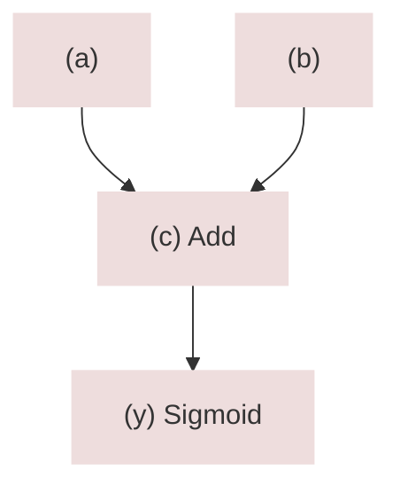

## In-place nodes

Let us motivate in-place nodes with an example.

Assume we have a simplified `Sigmoid` node defined like so:

```cpp
class SigmoidNode : public BaseDataNode<Real> {
 protected:                                                                  
  NodePtr<Real> in_;
                                                                             
  void forward_() override {                                                 
    value().resize(in_->value().shape());                                    
    value() = (in_->value().t() * 0.5).tanh() * 0.5 + 0.5;
  }                                                                          
  void backward_() override {                                                
    if (in_->has_grad()) {                                                   
      in_->grad() += value().t() * (1. - value().t()) * grad().t();
    }                                                                        
  }                                                                          
                                                                             
 public:                                                                     
  SigmoidNode(NodePtr<Real> in) : BaseDataNode<Real>({in}), in_(in) {}       
  
  std::string name() const override { return "Sigmoid"; }                           
};

// Factory
NodePtr<Real> Sigmoid(/*...*/) { return make_ptr<SigmoidNode>(/*...*/); }
```

Let's take the following graph:

```cpp
NodePtr<Real> a, b; // assume these are defined somehow...
auto y = Sigmoid(a + b);
```

which is effectively equivalent to the following graph:

```cpp
auto c = AddNode(a, b);
auto y = Sigmoid(c);
```

that looks like this:



Note that in the original version above, there is no `c` that could be referred to, later.
If we do not care about overwriting on top of `c` (`AddNode`), can we have an in-place
version of `Sigmoid` so that it does not need to allocate new memory but reuses `c`'s space?

Since a node has both a `value()` and a `grad()`, reusing in this case refers to reusing both.
There are two points to this consideration: What happens during forward and backward pass.

Assuming we do not need the intermediate value of `c`, we can map `y->value()` to `c->value()`.
Then `y->forward()` will overwrite and invalidate `c->value()`. That might be acceptable for
forward-pass, since `y->value()` stays the same regardless, and the downstream nodes will
all compute the same.

However, consider the backward pass: What happens when we call `c->backward()`? It might be relying on
its own value `c->value()` to compute its own gradients, however by this time `c->value()` is invalid,
it no longer carries the true output of `c`, it carries the output of `y` as it was overwritten.

This means we can only apply such an in-place node _if the input to it does not need `value()`
during its `backward()` pass_. Luckily for us, in the example above we have `AddNode`, and its
`backward()` looks like:

```cpp
void backward_() override {
  for (size_t i = 0; i < ins_.size(); i++) {
    if (ins_[i]->has_grad()) { ins_[i]->grad() += grad().t(); }
  }
}
```

It doesn't use `value()` anywhere in here. Therefore, even if its `value()` is invalidated by
the overwrite, we still backpropagate correct gradients in the reverse direction.

Now that we considered possible issues with respect to the input `c`, how can we go about
defining the actual in-place node `y` itself?

```cpp
class InPlaceSigmoidNode : public SigmoidNode {
 protected:
  using SigmoidNode::ins_;

  void backward_() override {
    if (in_->has_grad()) {
      in_->grad() = value().t() * (1. - value().t()) * grad().t();
    }
  }

 public:
  using SigmoidNode::SigmoidNode;

  const Tensor<Real>& value() const override { return in_->value(); }
  const Tensor<Real>& grad() const override { return in_->grad(); }
  bool has_grad() const override { return in_->has_grad(); }

  std::string name() const override { return "InPlaceSigmoid"; }
};

// Factory
NodePtr<Real> InPlaceSigmoid(/*...*/) { return make_ptr<InPlaceSigmoidNode>(/*...*/); }
```

- `value()` and `grad()` return the ones of the input, as expected from something "in-place".
- `forward_()` can be directly inherited from the original `Sigmoid` as is, so no override is needed.
  Whenever the original `forward_()` refers to `value()` and sets it, it will cause an in-place overwrite
  due to how we mapped the `value()` to `in_->value()`.
- `backward_()` needs just a bit more work. Normally we would accumulate gradients by
  ```cpp
  in_->grad() += /*...*/;
  ```
  However `in_->grad()` and `grad()` refers to the same tensor. If we accumulate, we would be
  summing the gradients of input and output (e.g. `c->grad().t() + y->grad().t()`), which would
  be incorrect. To account for this, instead of accumulating we simply assign and overwrite
  `in_->grad()`:
  ```cpp
  in_->grad() = /*...*/;
  ```
  Note that this also means that we lose the opportunity to properly accumulate
  when it is the right thing to do: When `in_` (`c`) is used in the computation graph
  multiple times. The above assignment instead of accumulation is correct only when
  `in_` is used in the graph once.

  But if we take a step back, this is not a strong ask at all: We are using an in-place
  node to overwrite on top of `in_` (`c`) anyways. If we were to use it multiple times
  in the graph, we would be getting invalid results even during the forward pass.

Therefore above definition of `InPlaceSigmoid` will work the way we envisioned, and
we are ready to use.

?> All of the in-place nodes in Ginn that fit the workflow described above have the
`InPlace` prefix in their names, such as `InPlaceAdd` or `InPlaceLayerNorm`.

## Caveats

Here is a summary of in-place nodes and the considerations that come with it:

```cpp
NodePtr<Real> a, b; // assume these are defined somehow...
auto c = a + b;
auto y = InPlaceSigmoid(c);
```

- We assume `c` is not used anywhere else in the graph, it feeds to exactly one node,
  in this case, `y`.
- When we call `Graph(y).forward()`, `c->value()` will be invalid but `y->value()` will
  be valid. This is because both map to the same tensor that has the output of `y`.
- When we call `Graph(y).backward()`, similarly, `y->grad()` will be invalid but `c->grad()`
  will be valid. This is because both map to the same gradient tensor which most recently
  has the gradients of `c`. By induction, this means `a->grad()` and `b->grad()` has
  the correct values.
- We assume `c->backward()` _does not use_ `c->value()`, because by the time `c->backward()`
  is called, `c->value()` will have been overwritten. If this assumption is violated, `c->grad()`
  and all of the gradients below (e.g. `a->grad()`, `b->grad()`) will be incorrect. I couldn't
  find a programmatic way to check for this assumption that wasn't intrusive, so this check is
  left to the user. Easiest way to check that everything is sane is to use gradient checks which
  Ginn provides as a utility in `testutil.h`.
- Finally, when designing in-place nodes, be mindful of aliasing considerations with Eigen,
  since same tensor will appear on both left- and right-hand side of the equation, both for forward
  and backward passes. See the
  [aliasing discussion in unsupported Eigen here](https://eigen.tuxfamily.org/dox/unsupported/eigen_tensors.html#title8)
  ,
  and [classical, supported Eigen here](https://eigen.tuxfamily.org/dox/group__TopicAliasing.html).


